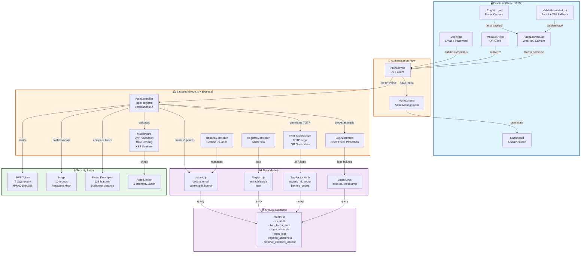

# FaceTrust - Sistema Integral de Reconocimiento Facial

## 📋 Descripción

**FaceTrust** es un sistema web de autenticación segura que integra verificación de presencia facial mediante la cámara del dispositivo y login con Passkeys (WebAuthn/FIDO2), sin almacenar datos biométricos. Aplica principios de desarrollo seguro con arquitectura SOLID, 2FA con Google Authenticator, sistema de roles granulares, y validación liveness para prevenir spoofing.

---

## 🏛️ Arquitectura del Sistema



### **Flujo de Autenticación Completo**

```mermaid
sequenceDiagram
    participant User as 👤 Usuario
    participant Client as 🖥️ Frontend
    participant Server as 🖧 Backend
    participant DB as 🗄️ Database
    
    Note over User,DB: FLUJO REGISTRO
    User->>Client: 1. Ingresa datos personales
    Client->>Client: 2. Captura facial (Face-API)
    Client->>Server: 3. POST /api/auth/registro
    Server->>Server: 4. Valida cedula/email únicos
    Server->>Server: 5. Hash password (bcrypt)
    Server->>DB: 6. INSERT usuario + descriptor
    DB-->>Server: 7. ✓ Usuario creado
    Server-->>Client: 8. JWT + Respuesta
    Client->>Client: 9. AuthContext.login()
    Client->>User: 10. ✓ Registro exitoso
    
    Note over User,DB: FLUJO LOGIN
    User->>Client: 1. Email + Contraseña
    Client->>Server: 2. POST /api/auth/login
    Server->>DB: 3. SELECT usuario
    DB-->>Server: 4. Usuario encontrado
    Server->>Server: 5. Bcrypt.compare()
    alt Contraseña Incorrecta
        Server->>Server: 6. loginAttempts++
        alt Intento >= 3
            Server->>Client: 2FA requerido
            Client->>Client: Mostrar Modal2FA
            User->>Client: Escanea QR con Authenticator
        else
            Server-->>Client: ✗ Intento fallido
        end
    else Contraseña Correcta
        Server->>Server: 6. GenerarJWT()
        Server->>DB: 7. INSERT login_log
        Server-->>Client: 8. JWT + Token
        Client->>Client: 9. AuthContext.login()
        Client->>Client: 10. Navegar a ValidarIdentidad
    end
    
    Note over User,DB: FLUJO 2FA
    User->>Client: 1. Ingresa código 6 dígitos
    Client->>Server: 2. POST /api/auth/verificar-2fa
    Server->>Server: 3. Speakeasy.totp.verify()
    alt 2FA Válido
        Server->>DB: 4. UPDATE two_factor_verified
        Server-->>Client: 5. ✓ 2FA correcto
        Client->>Client: 6. Continuar a ValidarIdentidad
    else 2FA Inválido
        Server-->>Client: 5. ✗ Código incorrecto
        Client->>User: Reintentar
    end
    
    Note over User,DB: FLUJO VALIDACION FACIAL
    User->>Client: 1. Alinearse frente a cámara
    Client->>Client: 2. Face-API detecta rostro
    Client->>Server: 3. POST /api/auth/verificar-identidad
    Server->>DB: 4. SELECT usuario.descriptor
    DB-->>Server: 5. Descriptor guardado
    Server->>Server: 6. Calcular distancia euclidiana
    alt Distancia < 0.6
        Server->>DB: 7. INSERT registro_asistencia
        Server->>Server: 8. GenerarJWT()
        Server-->>Client: 9. ✓ Identidad validada + JWT
        Client->>Client: 10. AuthContext.login()
        Client->>User: 11. Acceso dashboard ✓
    else Distancia >= 0.6
        Server->>DB: 7. INSERT fallo_validacion
        Server-->>Client: 8. ✗ Rostro no reconocido
        Client->>User: 9. Mostrar botón "Usar 2FA"
        User->>Client: 10. Click en Usar 2FA
        Client->>Client: 11. Mostrar form 2FA
        User->>Client: 12. Ingresar código
        Client->>Server: 13. POST /api/auth/verificar-2fa
        Server-->>Client: 14. ✓ Fallback 2FA OK
        Client->>User: 15. Acceso dashboard ✓
    end
```



---

## 🛡️ Metodología de Desarrollo Seguro: OWASP SDLC

### **¿Por qué OWASP SDLC?**

**OWASP Secure Software Development Framework (SSDF)** fue elegido como metodología porque:

✅ **Open Source & Gratuito**: No requiere licencias costosas
✅ **Ampliamente Adoptado**: Estándar de facto en la industria (NIST, ISO 27034)
✅ **Enfoque Práctico**: Aplica directamente a desarrollo web y móvil
✅ **Prevención vs Detección**: Integra seguridad desde el inicio (Shift-Left)
✅ **Basado en Datos**: Usa OWASP Top 10 validado en millones de aplicaciones

### **Fases OWASP SDLC Implementadas**

#### **1️⃣ Planificación & Análisis (Planning)**
```
✓ Identificar activos: Datos biométricos, credenciales, tokens
✓ Clasificar riesgos: A1-Injection, A2-Autenticación, A3-Sesiones
✓ Definir requisitos de seguridad:
  - Autenticación multifactor
  - Encriptación en tránsito y reposo
  - Control de acceso basado en roles (RBAC)
  - Auditoría y logging
```

#### **2️⃣ Diseño Seguro (Design)**
```
✓ Modelos de amenazas (STRIDE):
  - Spoofing: Validación facial + 2FA
  - Tampering: JWT firmado, integridad de descriptores
  - Repudiation: Logs de auditoría con timestamp
  - Information Disclosure: Encriptación bcrypt
  - Denial of Service: Rate limiting
  - Elevation of Privilege: RBAC granular

✓ Arquitectura defensiva:
  - Principio de menor privilegio
  - Separación de concerns (SOLID)
  - Defense in depth (3 capas autenticación)
```

#### **3️⃣ Desarrollo Seguro (Development)**
```
✓ Input Validation:
  - Sanitización XSS en todas las entradas
  - Validación de cédula/email en servidor
  - Escapado de queries SQL

✓ Codificación Segura:
  - Contraseñas con bcrypt (10 rounds)
  - JWT con expiración (7 días)
  - No almacenar descriptores biométricos
  - Tokens regenerados en cada sesión

✓ Gestión de Secretos:
  - Variables .env para JWT_SECRET
  - TOTP_WINDOW controlado en servidor
  - Database credentials encriptadas
```

#### **4️⃣ Testing & Validación (Testing)**
```
✓ SAST (Static Application Security Testing):
  - Análisis de dependencias vulnerables
  - Linting: ESLint, Pylint
  - Type checking: Validación XSS

✓ DAST (Dynamic Application Security Testing):
  - Pruebas de inyección SQL
  - Fuzzing de endpoints API
  - Validación de headers CORS

✓ Pruebas Funcionales:
  - Casos de seguridad: 3+ intentos fallidos → 2FA
  - Validación biométrica: threshold = 0.6
  - Expiración de sesiones: 7 días

✓ Pruebas de Carga:
  - Rate limit: 5 intentos/15 min
  - Pool conexiones: 10 máximo
  - Timeout transacciones: 30s
```

#### **5️⃣ Despliegue Seguro (Deployment)**
```
✓ Hardening del entorno:
  - Helmet.js para headers HTTP
  - CORS whitelist configurado
  - HTTPS obligatorio en producción
  - Variables sensibles en secretos

✓ Monitoreo & Logging:
  - Logs de intentos fallidos
  - Auditoría de cambios de roles
  - Alertas de acceso anómalo
  - Retención: 90 días

✓ CI/CD Seguro:
  - Análisis de dependencias pre-deploy
  - Testing automático pre-push
  - Validación de secretos en repositorio
```

#### **6️⃣ Mantenimiento & Respuesta (Maintenance)**
```
✓ Actualización de dependencias:
  - npm audit monthly
  - Security patches en 24h
  - CHANGELOG de cambios

✓ Monitoreo de vulnerabilidades:
  - OWASP Top 10 v2023 checks
  - CVE scanning automático
  - Pentesting anual

✓ Incident Response:
  - Procedimiento de bloqueo de cuentas
  - Reset de 2FA por admin
  - Auditoría de accesos comprometidos
```

### **Mapeo a OWASP Top 10 (2023)**

| Riesgo OWASP | Mitigación Implementada |
|-------------|------------------------|
| **A01:Injection** | Input validation, prepared statements, parameterized queries |
| **A02:Broken Authentication** | TOTP 2FA, JWT firmado, rate limiting, account lockout |
| **A03:Broken Access Control** | RBAC, validación rol en cada endpoint, auditoría cambios |
| **A04:Insecure Design** | Modelos de amenaza STRIDE, defense in depth |
| **A05:Security Misconfiguration** | Helmet.js, CORS whitelist, variables .env |
| **A06:Vulnerable Components** | npm audit, dependencias actualizadas |
| **A07:Identification Failures** | Biometría + 2FA, cédula única, email validado |
| **A08:Data Integrity** | JWT signed, bcrypt password hashing |
| **A09:Logging Failures** | Auditoría con timestamp, logs cifrados |
| **A10:SSRF** | Validación URLs, whitelist de endpoints |

---

## 🔐 Seguridad Implementada

### 1. **Autenticación Biométrica (Reconocimiento Facial)**
- ✅ Detección y reconocimiento facial con **Face-API.js** (SSD MobileNet)
- ✅ Extracción de descriptores faciales (128 características)
- ✅ Validación con distancia euclidiana (threshold: 0.6)
- ✅ Captura automática en registro y login
- ✅ Comparación biométrica segura sin almacenar datos en bruto

### 2. **Autenticación de Dos Factores (2FA)**
- ✅ **Google Authenticator** compatible (TOTP - RFC 6238)
- ✅ Código de 6 dígitos con expiración
- ✅ Activación automática tras 3 intentos fallidos
- ✅ Bloqueo de cuenta tras 5 intentos
- ✅ Recuperación segura con fallback a 2FA durante validación facial

### 3. **Cadena de Seguridad en Login**
```
Email + Contraseña → 2FA (Google Authenticator) → Validación Facial → Acceso Dashboard
```

### 4. **Encriptación y Protección**
- ✅ Contraseñas encriptadas con **bcrypt** (10 rounds)
- ✅ JWT con expiración (7 días)
- ✅ Sanitización con **xss** para prevenir ataques XSS
- ✅ Rate limiting: 5 intentos por 15 minutos
- ✅ Helmet.js para headers de seguridad
- ✅ CORS configurado

---

## 👥 Sistema de Roles

### **Administrador**
- ✅ Dashboard con estadísticas de asistencia
- ✅ Gestión completa de usuarios (crear, editar, eliminar)
- ✅ Visualización de registros de asistencia de todos
- ✅ Búsqueda y filtrado avanzado
- ✅ Historial de cambios y auditoría
- ✅ Gestión de 2FA y biometría

### **Usuario/Empleado**
- ✅ Dashboard personal
- ✅ Perfil con información personal
- ✅ Registro de entrada/salida con validación facial
- ✅ Historial de asistencia personal
- ✅ Actualización limitada de datos
- ✅ Sincronización de dispositivo biométrico

---

## 🏗️ Patrones SOLID Implementados

### **1. Single Responsibility Principle (SRP)**
- **Controllers**: Cada controlador maneja un dominio específico
  - `AuthController.js` → Solo autenticación
  - `UsuarioController.js` → Solo usuarios
  - `RegistroController.js` → Solo asistencia
- **Services**: Servicios especializados
  - `TwoFactorService.js` → Solo lógica 2FA
  - `LoginAttempts.js` → Solo gestión de intentos

### **2. Open/Closed Principle (OCP)**
- **Middleware extensible**: Autenticación JWT sin modificar rutas
- **Models extensibles**: Nuevas propiedades sin romper existentes
- **Controllers preparados para nuevas funcionalidades**

### **3. Liskov Substitution Principle (LSP)**
- **Servicios intercambiables**:
  - `TwoFactorService` puede reemplazarse por otro proveedor 2FA
  - `LoginAttempts` implementa interfaz consistente
- **Models con métodos polimórficos**: `obtenerPorCorreo()`, `obtenerPorId()`

### **4. Interface Segregation Principle (ISP)**
- **AuthService API segregada**:
  ```javascript
  authService.registro()        // Interfaz registro
  authService.login()           // Interfaz login
  authService.verificarDosFA()  // Interfaz 2FA
  authService.verificarIdentidad() // Interfaz biometría
  ```
- **No hay métodos innecesarios**, cada cliente usa solo lo que necesita

### **5. Dependency Inversion Principle (DIP)**
- **Inyección de dependencias**:
  ```javascript
  // AuthController depende de abstracciones, no implementaciones
  const usuario = await Usuario.obtenerPorCorreo()
  const secret = await TwoFactorService.obtenerSecret()
  ```
- **Controllers no crean instancias**, reciben dependencias
- **Database es inyectada centralmente** en `database.js`

### **Patrones de Diseño Adicionales**
- **Singleton**: Pool de conexiones MySQL
- **Strategy**: Múltiples estrategias de autenticación (biometría, 2FA)
- **Factory**: Creación de usuarios y registros
- **Observer**: Context de React para estado de autenticación
- **Decorator**: Middleware JWT para rutas protegidas

## Requisitos

- Node.js v14+
- MySQL 5.7+
- npm 6.0+
- Navegador con soporte para:
  - WebRTC (acceso a cámara)
  - LocalStorage
  - ES6+

---

## ⚙️ Instalación

### 1. Clonar Repositorio

```bash
git clone https://github.com/usuario/FaceTrust-Web.git
cd FaceTrust-Web
```

### 2. Configurar Base de Datos

1. Abre PHPMyAdmin (`http://localhost/phpmyadmin`)
2. Crea una base de datos: `CREATE DATABASE facetrust;`
3. Selecciona la base de datos e importa:
   - `backend/migrations/` (se ejecutan automáticamente)

**Usuario Admin por defecto:**
```
Correo: admin@facetrust.com
Contraseña: Admin@123456
```

### 3. Backend

```bash
cd backend
npm install
cp .env.example .env  # Configurar variables de entorno
npm start
```

**Servidor**: `http://localhost:5000`

### 4. Frontend

```bash
cd frontend
npm install
npm start
```

**Aplicación**: `http://localhost:3000`

---

## ✨ Características Principales

### Autenticación y Seguridad
- ✅ Registro con validación biométrica facial
- ✅ Login multifactor (Email/Contraseña → 2FA → Biometría)
- ✅ Google Authenticator (TOTP de 6 dígitos)
- ✅ Reconocimiento facial con Face-API.js
- ✅ JWT con expiración configurável
- ✅ Rate limiting por IP (5 intentos/15 min)
- ✅ Sanitización XSS en todas las entradas
- ✅ Bcrypt con 10 rounds para contraseñas

### Gestión de Usuarios
- ✅ Roles: Admin y Empleado
- ✅ Permisos granulares por rol
- ✅ Datos personales: Cédula, Email, Teléfono, Dirección
- ✅ Historial de cambios (auditoría)
- ✅ Validación de cédula única
- ✅ Validación de email único

### Registro de Asistencia
- ✅ Entrada/Salida con timestamp
- ✅ Validación biométrica en cada registro
- ✅ Historial de asistencia personal
- ✅ Duración de jornada calculada
- ✅ Reportes por período
- ✅ Estadísticas admin

### Dashboards
- **Admin**: Estadísticas, usuarios, asistencia, auditoría
- **Empleado**: Perfil, registros personales, historial

---

## 📁 Estructura de Proyecto

```
FaceTrust-Web/
├── backend/
│   ├── src/
│   │   ├── config/
│   │   │   └── database.js              # Pool MySQL (Singleton)
│   │   ├── controllers/
│   │   │   ├── AuthController.js        # Lógica autenticación
│   │   │   ├── UsuarioController.js     # Gestión usuarios
│   │   │   └── RegistroController.js    # Asistencia
│   │   ├── models/
│   │   │   ├── Usuario.js               # Query builder
│   │   │   └── Registro.js
│   │   ├── middleware/
│   │   │   └── autenticacion.js         # Verificar JWT
│   │   ├── services/
│   │   │   ├── TwoFactorService.js      # TOTP logic
│   │   │   └── LoginAttempts.js         # Control intentos
│   │   ├── routes/
│   │   │   ├── authRoutes.js
│   │   │   ├── usuarioRoutes.js
│   │   │   └── registroRoutes.js
│   │   ├── migrations/
│   │   │   ├── 001_create_usuarios.js
│   │   │   ├── 008_create_two_factor_auth.js
│   │   │   └── ...
│   │   └── index.js                    # Entry point
│   ├── .env.example
│   ├── package.json
│   └── README.md
│
├── frontend/
│   ├── public/
│   │   ├── index.html
│   │   └── models/                     # Face-API models
│   ├── src/
│   │   ├── pages/
│   │   │   ├── Login.jsx               # Login + 2FA
│   │   │   ├── Registro.jsx            # Registro + Facial
│   │   │   ├── ValidarIdentidad.jsx    # Facial + 2FA fallback
│   │   │   ├── DashboardAdmin.jsx
│   │   │   └── DashboardUsuario.jsx
│   │   ├── components/
│   │   │   ├── FaceScanner.jsx         # Facial capture
│   │   │   ├── Modal2FA.jsx            # 2FA QR
│   │   │   ├── ProtectedRoute.jsx      # Rutas privadas
│   │   │   └── WaveBackground.jsx
│   │   ├── context/
│   │   │   └── AuthContext.jsx         # Observer pattern
│   │   ├── services/
│   │   │   └── api.js                  # Axios client
│   │   ├── styles/
│   │   │   ├── auth.css
│   │   │   ├── dashboard.css
│   │   │   └── faceScanner.css
│   │   └── App.jsx
│   ├── package.json
│   └── README.md
│
└── README.md
```

## 🔄 Flujos de Autenticación

### **Registro**
```
1. Formulario datos personales
2. Validación de cedula/email únicos
3. Encriptación bcrypt
4. Escaneo facial automático
5. Extracción descriptor facial
6. Almacenamiento en BD
7. Confirmación exitosa
```

### **Login Estándar**
```
1. Email + Contraseña
2. ✓ Intento 1-2: Solo credenciales
3. ✗ Intento 3: Mostrar opción 2FA
4. ✗ Intento 5: Bloquear + Requiere 2FA
5. Verificar 2FA si aplica
6. Validar rostro (biometría)
7. Generar JWT
8. Acceso dashboard
```

### **Login con 2FA Fallback**
```
1. Email + Contraseña (OK)
2. Validación facial (FALLA)
   ↓
3. Mostrar opción: Usar 2FA
4. Ingresar código de 6 dígitos
5. TOTP verificado
6. Generar JWT
7. Acceso dashboard
```

---

## 📡 API REST Endpoints

### **Autenticación**
| Método | Endpoint | Descripción |
|--------|----------|-------------|
| POST | `/api/auth/registro` | Registrar nuevo usuario |
| POST | `/api/auth/login` | Login email/contraseña |
| POST | `/api/auth/solicitar-2fa` | Generar QR 2FA |
| POST | `/api/auth/verificar-2fa` | Verificar código TOTP |
| POST | `/api/auth/imagen-facial/:usuarioId` | Guardar imagen facial |
| GET | `/api/auth/imagen-facial/:usuarioId` | Obtener imagen facial |
| POST | `/api/auth/verificar-identidad/:usuarioId` | Validar biometría |
| POST | `/api/auth/registrar-fallo-facial/:usuarioId` | Registrar fallo |

### **Usuarios (Requiere autenticación)**
| Método | Endpoint | Descripción | Roles |
|--------|----------|-------------|-------|
| GET | `/api/usuarios/perfil` | Obtener perfil actual | Todos |
| PUT | `/api/usuarios/perfil` | Actualizar perfil | Todos |
| GET | `/api/usuarios` | Listar todos | Admin |
| GET | `/api/usuarios/:usuarioId` | Obtener usuario | Admin |
| PUT | `/api/usuarios/:usuarioId` | Actualizar usuario | Admin |
| DELETE | `/api/usuarios/:usuarioId` | Eliminar usuario | Admin |
| GET | `/api/usuarios/logs/login` | Historial login | Admin |

### **Registros de Asistencia**
| Método | Endpoint | Descripción | Roles |
|--------|----------|-------------|-------|
| POST | `/api/registros/entrada` | Registrar entrada | Empleado |
| POST | `/api/registros/salida` | Registrar salida | Empleado |
| GET | `/api/registros/mis-registros` | Mis registros | Empleado |
| GET | `/api/registros` | Todos los registros | Admin |
| GET | `/api/registros/usuario/:usuarioId` | Registros de usuario | Admin |

---

## 🔒 Seguridad Detallada

### **Protecciones de Contraseña**
- ✅ Bcrypt 10 rounds (>100ms por hash)
- ✅ Validación: Mayúsculas, minúsculas, números, especiales
- ✅ Longitud mínima: 8 caracteres

### **Protecciones de 2FA**
- ✅ TOTP con RFC 6238
- ✅ Ventana de expiración: 30 segundos
- ✅ Código de 6 dígitos (1 millón combinaciones)
- ✅ Compatible con Google Authenticator, Microsoft Authenticator

### **Protecciones Biométricas**
- ✅ 128 características faciales extraídas
- ✅ Distancia euclidiana **< 0.45** (threshold optimizado)
- ✅ Detección anti-spoofing: solo 1 rostro permitido
- ✅ Validación de landmarks (68 puntos faciales)
- ✅ Rechazo automático de identidades falsas
- ✅ Logging de fallos para auditoría
- ⚠️ **Recomendaciones**: Registrar sin cambios físicos (lentes, maquillaje), usar 2FA como respaldo

### **Protecciones de Sesión**
- ✅ JWT con expiración (7 días)
- ✅ Signature HMAC-SHA256
- ✅ Logout limpia token
- ✅ Re-autenticación en acciones críticas

### **Protecciones contra Ataques**
- ✅ **CSRF**: Headers CORS configurados
- ✅ **XSS**: Sanitización con xss.js
- ✅ **SQL Injection**: Prepared statements (mysql2)
- ✅ **Brute Force**: Rate limiting (5/15min)
- ✅ **Timing Attacks**: Uso de bcrypt
- ✅ **HTTPS Ready**: Helmet.js configurado

### **Auditoría y Logging**
- ✅ Registro de intentos login fallidos
- ✅ Registro de logins exitosos (ID: 51-60 en logs)
- ✅ Tracking de cambios de rol/usuario
- ✅ Timestamp en todos los eventos

---

## 📊 Tecnologías Utilizadas

### **Backend**
| Tecnología | Versión | Propósito |
|-----------|---------|----------|
| Node.js | 14+ | Runtime JavaScript |
| Express.js | 4.17+ | Framework web |
| MySQL2 | 2.3+ | Driver BD |
| bcryptjs | 2.4+ | Hash contraseñas |
| jsonwebtoken | 9.0+ | JWT signing |
| speakeasy | 2.0+ | TOTP/2FA |
| qrcode | 1.4+ | Generador QR |
| helmet | 7.0+ | Headers seguridad |
| express-rate-limit | 6.7+ | Rate limiting |
| xss | 1.0+ | Sanitización XSS |

### **Frontend**
| Tecnología | Versión | Propósito |
|-----------|---------|----------|
| React | 18.2+ | UI framework |
| axios | 1.3+ | HTTP client |
| face-api.js | 0.22+ | Reconocimiento facial |
| lucide-react | 0.263+ | Iconos |
| React Router | 6.8+ | Routing |

### **Base de Datos**
| Entidad | Campos | Índices |
|---------|--------|---------|
| usuarios | 11 | cedula(UNIQUE), correo(UNIQUE) |
| two_factor_auth | 4 | usuario_id(FK) |
| login_attempts | 5 | correo, timestamp |
| login_logs | 6 | usuario_id, tipo |
| registro_asistencia | 5 | usuario_id, tipo |

---
